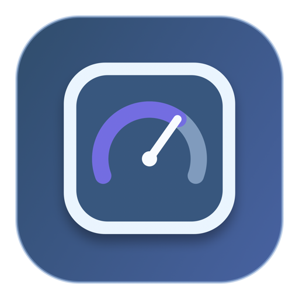

# Codex Usage Menu



A small, open-source macOS menu bar app that shows how much of your **Codex allowance remains** and includes an optional keyboard auto-presser in the same popover.

It is an independent community project, not an official OpenAI app. It does not show general ChatGPT chat usage or OpenAI API billing.

## What it does

- Shows the lowest remaining percentage among the Codex quota windows reported for your account beside a gauge icon in the menu bar (`95%`, for example).
- Shows each available window's usage and time until reset when you click the menu bar item.
- Refreshes on launch, every two minutes, and when you click the refresh button.
- Lets you auto-press a chosen key after a delay, at a chosen interval, for a fixed number of repeats or indefinitely. Press **⌘⌥S** or reopen the popover to stop.
- Saves your last valid auto-press settings in macOS `UserDefaults`.

The usage data comes from the signed-in Codex CLI's documented [`account/rateLimits/read` app-server method](https://learn.chatgpt.com/docs/app-server). The app starts `codex app-server` locally for each refresh; it does not read or store your login tokens.

## Requirements

- macOS 13 or newer.
- Xcode Command Line Tools (for `swiftc`, `iconutil`, and `codesign`). Run `xcode-select --install` if they are missing.
- A recent [Codex CLI](https://learn.chatgpt.com/docs/codex/cli) installed and signed in with a **ChatGPT-backed account**. API-key-only authentication does not supply the ChatGPT allowance this app displays.

Verified on macOS 27.0 (Apple silicon): the source build, code signature, Codex allowance lookup, preview UI, refresh control, and Auto Press key picker work. A crowded menu bar or third-party menu bar manager can still keep the status item off screen. Keyboard injection was not part of that check because it requires the user's Accessibility grant.

## Build and run

```sh
git clone https://github.com/ammaster10s/codex-usage-menu.git
cd codex-usage-menu
./build.sh
open "build/Codex Usage.app"
```

The build creates an ad-hoc signed app locally; no Xcode project or third-party package is required. This repository distributes source, not a notarized binary. There is no Dock icon: look for the gauge icon and remaining percentage in the macOS menu bar. Click it to open the popover. Use its power button to quit.

You can check usage from Terminal without opening the UI:

```sh
"build/Codex Usage.app/Contents/MacOS/CodexUsageMenu" --check
```

## Auto Press and macOS permissions

Auto Press is optional. Choose a key, set an interval of at least `0.02` seconds, set a repeat count (`0` means unlimited), and allow enough start delay to focus the target app. Click **Start pressing**. The menu bar icon gains an activity dot while a run is starting or active.

macOS requires an **Accessibility** grant for keyboard injection. Click **Enable Accessibility** in the popover, then enable **Codex Usage** under **System Settings → Privacy & Security → Accessibility**. Return to the app and start again. The global stop shortcut may also require **Input Monitoring** access on some macOS configurations; the popover's **Stop pressing** button remains available.

Use Auto Press only in applications and workflows where automated input is appropriate. When repeat count is `0`, it continues until stopped or the app quits.

## Troubleshooting

| Symptom | Check |
| --- | --- |
| `Codex CLI was not found` | Confirm `codex --version` works in Terminal. The app searches `~/.local/bin`, `/opt/homebrew/bin`, `/usr/local/bin`, and its `PATH`. |
| No allowance appears | Run `codex` and sign in with ChatGPT, then use the popover's refresh button. The CLI account must have a Codex allowance. |
| Menu bar item is missing | Check **System Settings → Menu Bar → Allow in the Menu Bar → Codex Usage**. On a notched Mac, check the menu bar's overflow control when space is tight. If you use a menu bar manager, place Codex Usage in its Visible section. Thaw 3.0.0-alpha.7 has a [reported helper crash](https://github.com/thaw-app/Thaw/issues/1194) on macOS 27; update Thaw when a fix is released. Make sure another copy of Codex Usage is not already running. |
| Auto Press does not start | Grant Accessibility to **Codex Usage**, then reopen the popover and try again. If you rebuild or move the app, macOS may ask you to grant access again. |
| Stop shortcut does not work | Reopen the popover and click **Stop pressing**. Check macOS Input Monitoring permissions if the global shortcut is unavailable. |

The popover shows the last known allowance with a refresh error if a later check fails. It never treats missing data as zero remaining.

## Privacy and development

The app asks the local Codex CLI for rate limits; the CLI handles its own authentication and network connection. Auto Press settings remain on your Mac in `UserDefaults`. The app has no analytics, telemetry, or bundled credentials.

Run `./build.sh` after changing Swift or the icon source. To open the interface in a regular window while developing, run:

```sh
open -n "build/Codex Usage.app" --args --preview
```

See [CONTRIBUTING.md](CONTRIBUTING.md) for contribution and verification notes. The project is available under the [MIT License](LICENSE).
