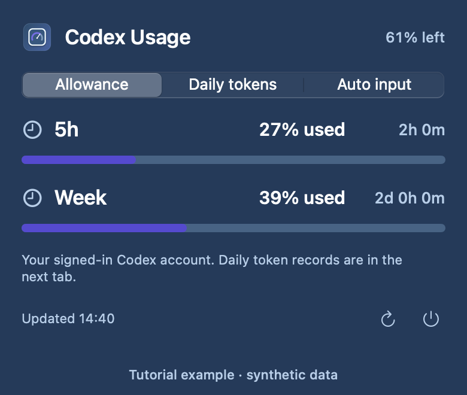
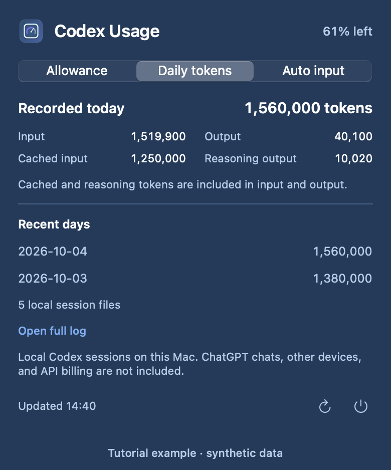
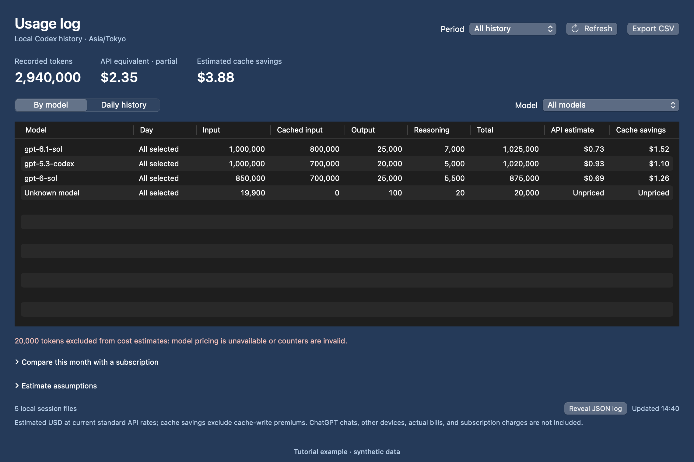
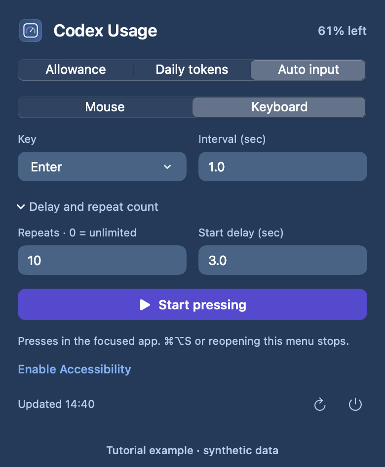

# Codex Usage Menu


A standalone macOS menu bar app for checking your **Codex allowance**, logging **daily local token usage**, and optionally automating mouse clicks or key presses.

This is an independent community project, not an official OpenAI app. It can run alongside iStat Menus and does not manage other menu bar icons.

## Codex and Claude support

**Usage tracking currently supports Codex. Claude usage tracking is not implemented.**

| Feature | Codex | Claude Code / Claude app |
| --- | --- | --- |
| Remaining allowance and reset times | Signed-in Codex account | Not supported |
| Daily tokens, full history, model breakdown, CSV | Local Codex session records | Not supported |
| API cost and cache-savings estimates | Models with reviewed OpenAI prices | Not supported |
| Optional mouse clicks / keyboard presses | General macOS input | Can target the focused app; live Claude input is not verified |

The app invokes `codex app-server`, reads local Codex session records, and uses an OpenAI pricing catalog. Installing Claude alongside Codex does not make Claude sessions appear in this app. Regular ChatGPT and Claude web/desktop conversations are not indexed.

Claude Code integration is possible, but requires its own usage reader and Anthropic pricing. Claude records input, output, cache reads, and cache creation differently from Codex, so reusing the Codex calculation would give incorrect totals. See [Claude Code usage monitoring](https://code.claude.com/docs/en/monitoring-usage) and [Anthropic pricing](https://platform.claude.com/docs/en/about-claude/pricing). Claude account allowance would need a separate integration as well.

## What it does

The existing gauge icon shows the lowest remaining percentage among the Codex allowance windows returned for your signed-in account. Click it for three compact tabs:

- **Allowance:** remaining usage and reset time for each available window.
- **Daily tokens:** today's recorded input, output, cached-input, and reasoning-output counts, plus the last seven recorded days. **Open full log** opens the complete history in a separate window.
- **Auto input:** choose **Mouse** or **Keyboard**. Only the selected tool's controls appear; delay and repeat count are tucked into an expandable section.

The app refreshes allowance and token records on launch, every two minutes, and when you click refresh. The clicker and keyboard presser share an activity indicator and never run together.

## Requirements

- The app declares macOS 13 as its minimum. The current build has been tested on **macOS 27 with Apple Silicon**; older macOS versions and Intel Macs have not been verified. Source builds use the local compiler's default target and architecture.
- Xcode Command Line Tools for a source build (`swiftc`, `iconutil`, and `codesign`).
- A recent [Codex CLI](https://learn.chatgpt.com/docs/codex/cli), signed in with a ChatGPT-backed account, for the allowance display. API-key-only authentication does not provide this account allowance.
- Local Codex session records for the daily token counter.
- Accessibility permission for optional mouse and keyboard automation.

## Build and run

1. Open **Terminal**. If Xcode Command Line Tools are missing, run `xcode-select --install` and finish their installation.
2. Install the [Codex CLI using the official instructions](https://learn.chatgpt.com/docs/codex/cli), then run:

   ```sh
   codex --version
   codex login
   ```

   Sign in with **your own ChatGPT account**. The app uses that local login; you do not need the repository owner's account or credentials. See [Codex authentication](https://learn.chatgpt.com/docs/auth).
3. Quit any older copy of **Codex Usage**, then clone, build, and install:

```sh
git clone https://github.com/ammaster10s/codex-usage-menu.git
cd codex-usage-menu
./build.sh
ditto "build/Codex Usage.app" "/Applications/Codex Usage.app"
open "/Applications/Codex Usage.app"
```

`ditto` is macOS's built-in copy command. Here it copies the built app into **Applications**, replacing an existing copy. You can also drag `build/Codex Usage.app` into Applications in Finder. Run one copy of the app at a time.

The build creates an ad-hoc signed app without an Xcode project or third-party packages. This repository distributes source, not a notarized binary. The regular app has no Dock icon; find its gauge and percentage in the menu bar. On macOS 27, use the copy in `/Applications`.

To update an existing checkout, quit the running app, run `git pull --ff-only`, then repeat `./build.sh`, `ditto`, and `open` above.

## Tutorial

The images below render the app's current views with **synthetic example data**. They contain no personal account or session history.

### 1. Check remaining allowance

Click the gauge in the menu bar and select **Allowance**. Each row shows the returned account window and its reset time. The menu bar percentage uses the lowest remaining window, so the most restrictive allowance stays visible.



### 2. Open the token history

Select **Daily tokens** for today's recorded counts and recent days. Cached input is part of input, and reasoning is part of output. Click **Open full log** to open the larger history window.



### 3. Compare models and export the log

In the full log:

1. Choose **Period**: All history, This month, Last 7 days, or Today.
2. Use **By model** for model totals or **Daily history** for day/model rows.
3. Use **Model** to focus on one recorded model.
4. Read **API estimate** and **Cache savings**. **Unpriced** means a verified price is unavailable; those tokens are kept in the totals but excluded from dollar estimates.
5. Click **Export CSV**, choose a location, and save. The CSV exports the filtered **daily model rows**, even while the table shows model totals. Unknown dollar amounts are left blank.



Expand **Estimate assumptions** for the pricing source and review date. **Reveal JSON log** in the footer opens the local numeric history in Finder. Expand **Compare this month with a subscription** and enter your monthly price in USD for a hypothetical comparison; it always uses this month's usage across all models, independently of the table filters.

### 4. Use optional mouse or keyboard input

Select **Auto input**, choose **Mouse** or **Keyboard**, and set the interval. Expand **Delay and repeat count** to choose a start delay and a finite count (`0` means unlimited). The keyboard example below repeats Enter ten times after a three-second delay.



Click **Enable Accessibility** and enable **Codex Usage** in **System Settings → Privacy & Security → Accessibility**. Start the tool, then use the delay to position the pointer or focus the target app. **⌘⌥S** or reopening the Codex Usage menu stops it. Neither tool starts automatically, and they never run together.

## Verification

For verification without posting mouse or keyboard input:

```sh
"build/Codex Usage.app/Contents/MacOS/CodexUsageMenu" --check
"build/Codex Usage.app/Contents/MacOS/CodexUsageMenu" --check-input
"build/Codex Usage.app/Contents/MacOS/CodexUsageMenu" --check-token-parser
"build/Codex Usage.app/Contents/MacOS/CodexUsageMenu" --check-token-costs
"build/Codex Usage.app/Contents/MacOS/CodexUsageMenu" --check-tokens
```

`--check` reads the current allowance. `--check-input` validates automation settings and constructs events without sending them. `--check-token-parser` and `--check-token-costs` use synthetic fixtures. `--check-tokens` reads your real local token records and saves the daily log.

## Daily token records

The counter reads numeric `token_count` events from local Codex JSONL records under `~/.codex/sessions` and `~/.codex/archived_sessions`, or those folders inside `CODEX_HOME` when set. It groups token increases by calendar day in your Mac's current time zone. Duplicate records, resumed sessions, archived copies, and copied fork history are reconciled before aggregation.

**Coverage is local Codex records on this Mac.** This does not include ordinary ChatGPT conversations, Claude sessions, other devices, sessions without token records, or account-wide API billing. The allowance percentage and token count measure different things; the app does not infer allowance percentages or actual bills from token counts.

Cached input is already included in input tokens, and reasoning output is already included in output tokens. They are displayed as breakdowns, not added again to the total. Missing or unreadable sources are reported. The app keeps the last known records if a source becomes unavailable.

The local log and incremental index are saved in:

```text
~/Library/Application Support/Codex Usage/daily-token-usage.json
```

Use **Open full log** in the Daily tokens tab, then **Reveal JSON log** to find this file. The first scan can take time for large histories; subsequent refreshes read changed files. Existing logs are backfilled when the app starts, so it does not need to run all day. Retained numeric records preserve daily history if source files are later removed. Time-zone changes regroup the saved records.

### Full usage log and cost estimates

The full log shows all recorded history **by model** or **by day and model**. Filter by period and model, or export the selected daily rows to CSV. Model identifiers come from recorded session/turn context; missing or ambiguous attribution appears as **Unknown model**. Updating from the earlier token logger rescans available sources once to add model names and retains numeric history from missing sources.

**Estimated API equivalent** compares recorded tokens with reviewed, current Standard API short-context USD prices. It applies the input rate to uncached input, the cached-input rate to cached input, and the output rate to output. Reasoning is included in output. **Estimated cache savings** shows the cache-read discount compared with charging cached input at the uncached rate.

With rates in USD per million tokens:

```text
API estimate = ((input − cached input) × input rate
              + cached input × cached-input rate
              + output × output rate) / 1,000,000
```

These are approximate comparisons, not your Codex bill, historical spend, or confirmed money saved. Local records do not identify cache writes, context-length premiums, service tiers, regional premiums, or tool fees. Cache savings exclude cache-write premiums. Models without a verified published price remain **Unpriced** and are excluded from dollar totals; their tokens remain visible. Prices were reviewed on **2026-10-04**, with sources and assumptions available in the window. The app does not silently substitute a price for an unknown model.

Expand **Compare this month with a subscription** and enter your monthly price in USD to compare this month's recorded API equivalent with that amount. The comparison uses all models for the current calendar month, independently of the table filters. It compares month-to-date usage with the full monthly price and does not value other subscription benefits. Missing prices make the comparison partial.

Session-log formats can change with Codex updates. These are recorded local counts, not a complete account usage or billing report. The allowance display uses the documented [`account/rateLimits/read` app-server method](https://learn.chatgpt.com/docs/app-server).

## Mouse and keyboard automation

Open **Auto input**, choose Mouse or Keyboard, and pick a mouse button or key. Set an interval of at least `0.02` seconds. Expand **Delay and repeat count** to set a start delay and number of clicks or key presses (`0` means unlimited).

- Mouse clicks use the pointer's current location. Use the start delay to move it to your target.
- Keyboard presses go to the focused app. Use the start delay to focus your target.
- Press **⌘⌥S**, reopen the Codex Usage menu, or click **Stop** to cancel a waiting or active run. Quitting also stops it.
- Settings are saved separately for mouse and keyboard. Neither tool starts automatically on launch.

Click **Enable Accessibility**, then enable **Codex Usage** under **System Settings → Privacy & Security → Accessibility**. Return to the app and start again. A rebuild or move may require a new grant. The global stop shortcut may also require Input Monitoring on some macOS configurations; reopening the menu remains available.

## Troubleshooting

| Symptom | Check |
| --- | --- |
| Codex CLI was not found | Confirm `codex --version` works in Terminal. The app searches `~/.local/bin`, `/opt/homebrew/bin`, `/usr/local/bin`, and its `PATH`. |
| No allowance appears | Sign in to Codex with ChatGPT, then refresh. Missing data is not treated as zero allowance. |
| Menu bar icon is missing | On macOS 27, run from `/Applications` and check **System Settings → Menu Bar → Allow in the Menu Bar → Codex Usage**. If using a menu bar manager, put Codex Usage in its Visible section. Avoid running multiple copies. |
| Daily tokens are missing or partial | Check the source-coverage message. Only local sessions that record numeric token events can be counted. |
| Automation does not start | Grant Accessibility to Codex Usage, reopen its menu, and try again. |
| Stop shortcut does not work | Reopen the menu to stop. Check Input Monitoring if the global shortcut is unavailable. |

## Privacy and development

The local Codex CLI handles its own authentication and network access for allowance checks. The token reader stores timestamps, model identifiers, numeric counters, and source-file metadata; it does not store prompts, replies, or credentials in its daily log. Pricing is a bundled local catalog; viewing estimates requires no API key or new network request. Automation settings and the optional subscription price stay in `UserDefaults`. The app has no analytics or telemetry.

To inspect the interface in a regular development window:

```sh
open -n "build/Codex Usage.app" --args --preview
open -n "build/Codex Usage.app" --args --preview-log
```

See [CONTRIBUTING.md](CONTRIBUTING.md) for validation notes. The project is available under the [MIT License](LICENSE).

To regenerate the tutorial images on macOS, run `./scripts/render_tutorial.sh`. It renders the same SwiftUI views offscreen with sample data and does not read local usage records or send input.
